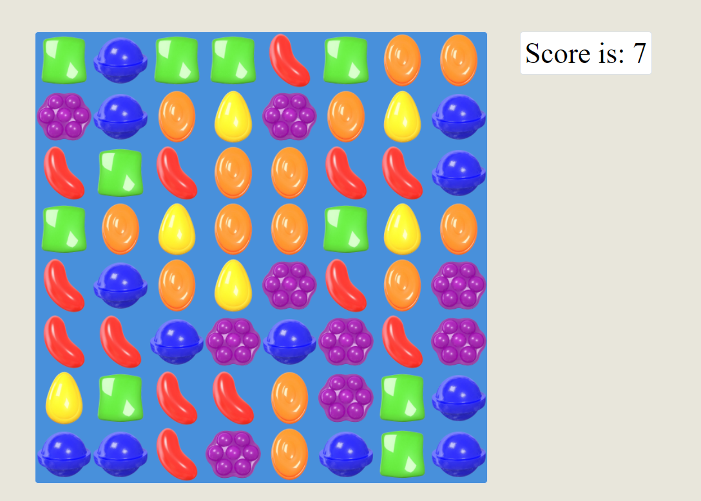

# Candy Crush
 Simple match three game.
## Tools and Libraries
 In this project I use : 
    - SASS extension. 
    - React.

## Usage
    Simple game where you need to collect similar elements in a row or a coloumn.
## Screenshot

## Links
[Source code](https://github.com/mikitapapok/matchThree/tree/candyCrush/src)
 
[deployed project](https://mikitapapok.github.io/matchThree/)

